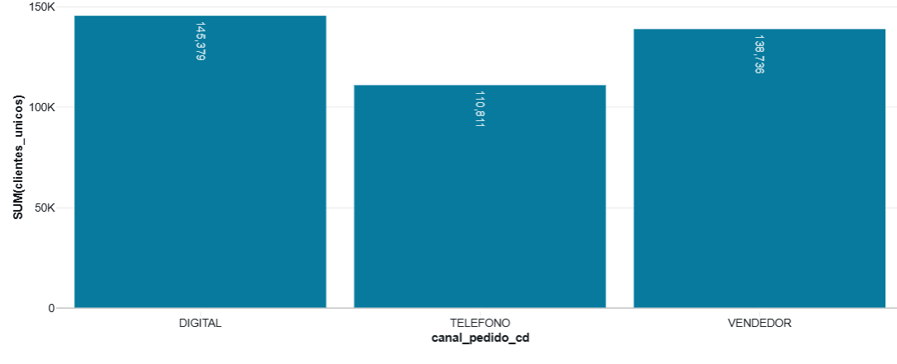
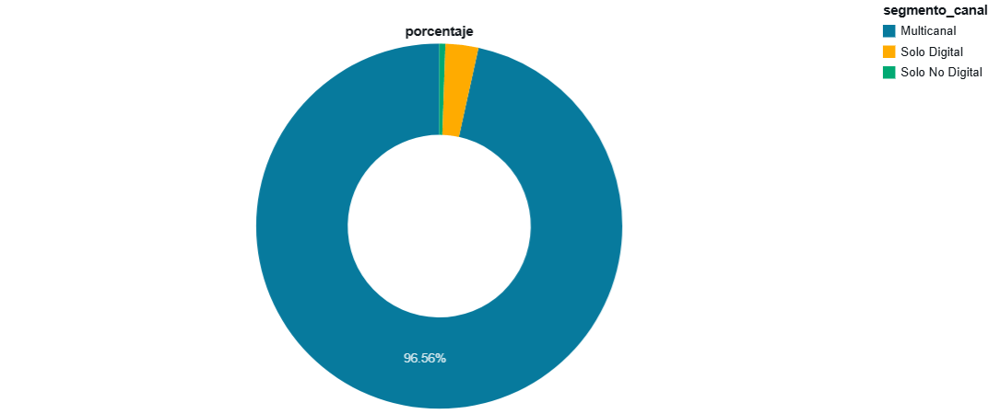
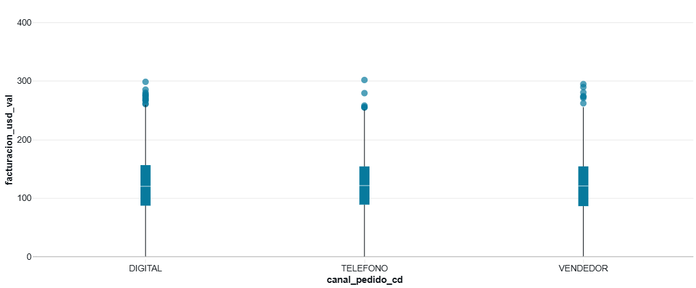
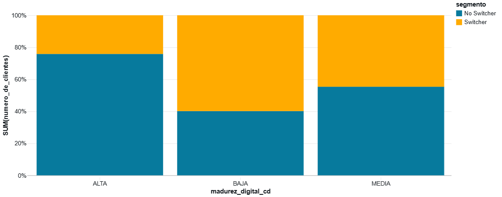

### **Hallazgos del Análisis Predictivo de Pedidos Digitales**

## 1. Preguntas Clave al Negocio

Antes de seguir explorando lo datos o revisando modelos, sentí que era crucial devolverle la pelota al negocio. Tenía que preguntar:

* ¿Por qué **realmente** queremos digitalizar a los clientes?
* ¿Es para bajar costos de operación (traducido: gastar menos en gente y procesos manuales)?
* ¿O es para mejorar la experiencia de los clientes en canales digitales?

Sin esas respuestas claras, sabía que se corre el riesgo de perseguir fantasmas. Para mí, el *feedback loop* es lo que mantiene los proyectos vivos y enfocados. Yo me negaria  a avanzar demasido a ciegas.

---

## 2. Contexto de los Datos

Aquí me topé con el clásico "faltó contexto". No sabía de dónde salían los datos, qué significaban en la operación ni qué objetivo cubrían. Tenía 8  archivos parquet, pero nadie me había contado la historia detrás. Aprendí que la **documentación** no es opcional; es la diferencia entre un análisis útil y la adivinación con Power BI. Igual se avanzo con la prueba =P. 

---

## 3. Variables sin Documentación

Encontré varias variables que sentí que debían ser clave para cualquier negocio:

* `pais_cd`
* `region_comercial_txt`
* `tipo_cliente_cd`

Esto me llevó a preguntas que, para mí, eran de gran valor:

* ¿Las campañas de digitalización deben cambiar según el país?
* ¿Qué pasa si el problema se busca enfocar en una región(es) específica(s) (donde duele mas)?
* ¿Cómo sé qué tipo de cliente es prioritario si ni siquiera está definido?

Sentí que si no aclaraba esto, el modelo terminaría decidiendo por mí, y probablemente de forma incorrecta.

---

## 4. Primeros Hallazgos (EDA General)

En mi primer Análisis Exploratorio de Datos (EDA), encontré que los datos tenían poca variabilidad. Las transacciones y los canales parecían clones. Mi principal dificultad fue cómo diferenciar lo que era básicamente lo mismo.
El eda partio de 3 preguntas:
1. ¿Son Diferentes los Pedidos Digitales? 
2. ¿Quiénes son los Clientes Digitales? (Atributos del Cliente)
3. ¿Cómo se Comportan los Clientes Digitales? (Historial y Frecuencia)

Las variables de clientes y transacciones se veían tan uniformes que parecía que alguien las había planchado. No pude encontrar diferencias claras entre las transacciones digitales, las del vendedor o las telefónicas. Me di cuenta de que no era tan fácil como creía. La única luz al final del túnel fue la variable **`pedidos_por_cliente`** (la cual calculé), que mostró algo más de diferenciacion.

Pense que si todo se veía igual, el modelo no serviría de nada. Tenía que pensar en *features* más creativos o cruzar fuentes adicionales para encontrar lo que realmente separa a un cliente digital de uno que no. Como no era posible, decidi tomar medidas drásticas.

📊  **Pedidos promedio por canales**

---

## 5. Hipótesis de Negocio y Segmentación

Dada mi frustración por no encontrar nada para segmentar o diferenciar los datos, decidí partir de una hipótesis de negocio (que podía validar rápidamente, pero era lo que me decía la intuición):

> **Es más importante analizar a los clientes que tienen menos de 60 días desde su última transacción, pues representan un mayor valor potencial para el negocio.**

Para validar esta hipótesis y enfocar mi análisis, hice lo siguiente:

* **Excluí** a los clientes **no digitales** (aquellos que nunca usaron el canal digital) y a los **solo digitales** (los que ya estaban completamente convertidos). Me pareció que los no digitales son más difíciles de digitalizar y los digitales no eran mi objetivo.
* **Me enfoqué** únicamente en clientes **multicanal** para ser más asertivo en el análisis de la elección de canal.

Con esta base, realicé un nuevo **EDA segmentado** , sin saber que me esperaba.

📊 **Distribuccion por pido de cliente**

---

## 6. Segundo Hallazgo (EDA Segmentado)

Mi segundo análisis exploratorio, enfocado en el segmento multicanal, mostró mayor variación en variables clave, lo que me indicó que eran buenos predictores para diferenciar el comportamiento. Aun asi , la mayoria de variables seguien sin poder diferenciar las transaccions digitales de las demas.

* `facturacion_promedio`
* `madurez_digital_cd`

Estas nuevas variables me ofrecieron un mejor potencial para diferenciar a los clientes y predecir su comportamiento. Sentí que irrumpí en los datos y, al mismo tiempo, les di una hipótesis y un norte más claro: predecir a los clientes recientes en sus transacciones que usan canales tanto digitales como no digitales.

📊 **Boxplot de facturacion por Canal (Segmento Multicanal)**

📊 **Distribución de madurez_digital_cd por Canal (Segmento Multicanal)**

---

### **7. Ingeniería de Datos: Enfoque y Metodología**

Para el desarrollo del modelo, prioricé las columnas de datos que identifiqué como relevantes durante el **EDA segmentado**. Con el objetivo de generar una variable objetivo para la predicción, construí el *target* del modelo a partir del comportamiento de la última transacción del cliente.

Definí el *target* de forma binaria: la última transacción digital la etiqueté como "cliente digital" y la última no digital como "cliente no digital". Utilicé esta variable para entrenar el modelo en la **predicción de la próxima transacción**. Mi enfoque se centró en la creación de una variable clara para la modelación, a partir de una simplificación del comportamiento histórico del cliente.

---

## **8. Modelado y Experimentación**

Para la fase de modelado, implementé un **proceso de experimentación exhaustivo**. A falta de herramientas de MLOps como MLflow, opté por crear una **grilla de 90 modelos** usando la librería `scikit-learn`. Este enfoque de validación masiva me permitió evaluar una amplia gama de algoritmos y configuraciones de hiperparámetros.

Mi objetivo era **identificar el modelo con el mejor rendimiento**. El mejor modelo que encontré tiene un **AUC de 0.74**, un resultado prometedor para un primer intento. Este rendimiento sugiere que el enfoque de segmentación y la ingeniería de características fueron efectivos.

---

## **9. Despliegue del Modelo y *Endpoint***

Para demostrar la viabilidad de la solución, desarrollé una API sencilla con Flask y la configuré como un *endpoint* para exponer el modelo. Este **prototipo de despliegue** permite probar las predicciones del mejor modelo en un entorno controlado, validando su funcionalidad y preparándolo para una posible integración futura.

---

## **10. Áreas de Oportunidad y Futuras Mejoras**

Identifiqué varias áreas clave para mejorar el modelo y el análisis:

* **Revisión del aporte de las variables**: Es crucial profundizar en la importancia de las variables (*feature importance*) para entender cómo contribuyen a las predicciones del modelo.
* **Exploración de la regresión**: En lugar de una clasificación binaria, se podría predecir el **nivel de digitalización del cliente** como un valor numérico (por ejemplo, el porcentaje de transacciones digitales). Esto ofrecería una visión más matizada del comportamiento del cliente.
* **Búsqueda de más datos**: Para explicar mejor el fenómeno, es fundamental buscar **variables adicionales** que no estaban disponibles en el conjunto de datos inicial. Esto podría incluir datos transaccionales más detallados, información demográfica o interacciones con campañas de marketing.

---

### **11. Conclusiones y Próximos Pasos**

Mis hallazgos y el análisis del proyecto me llevaron a las siguientes conclusiones clave:

1.  **Contexto y conocimiento del negocio**: El éxito de cualquier proyecto de *machine learning* depende de un profundo entendimiento del negocio y de los datos. Esto es un área crucial para la mejora.
2.  **Importancia de la variabilidad**: La falta de variabilidad inicial en los datos entre canales fue un desafío significativo. El enfoque de **segmentación** fue fundamental para superar esta limitación. Lo ideal sería contar con más datos que muestren diferencias sustanciales entre los clientes para un análisis más profundo.
3.  **Variables relevantes**: Tal vez la mejor manera de segmentar a los clientes, con la información disponible, es identificar a aquellos más recientes, con mayores *tickets* y con un mayor nivel de digitalización.
4.  **Mejora de los modelos predictivos**: Los modelos pueden mejorarse significativamente con un enfoque más riguroso en la **segmentación** (con el apoyo de negocio) y en la **ingeniería de características**.
5.  **Rendimiento del modelo**: El modelo desarrollado tiene un rendimiento inicial sólido con un **AUC de 0.74**, lo que lo establece como una base prometedora para futuras iteraciones y mejoras.
6.  **Revisión del objetivo**: Si el objetivo de negocio cambia, por ejemplo, si se busca predecir qué cliente está más cerca de ser digital en lugar de una clasificación binaria, el modelo y su variable objetivo deben ajustarse para reflejar esta nueva meta.
